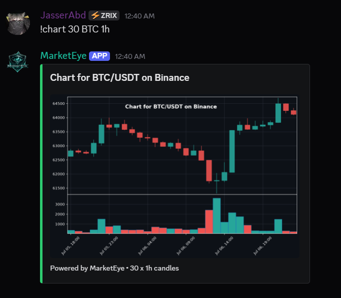
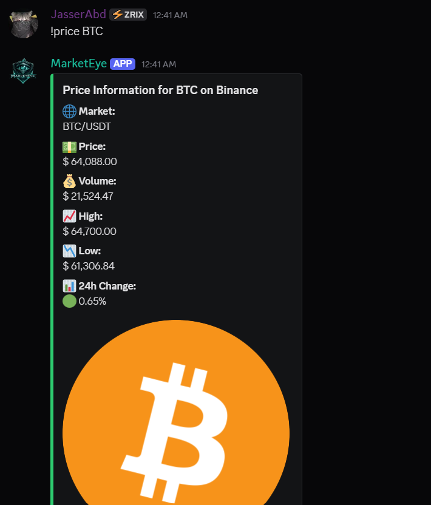
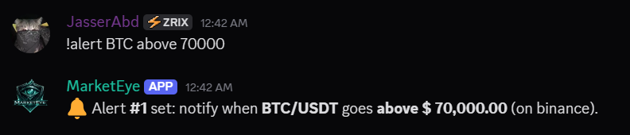
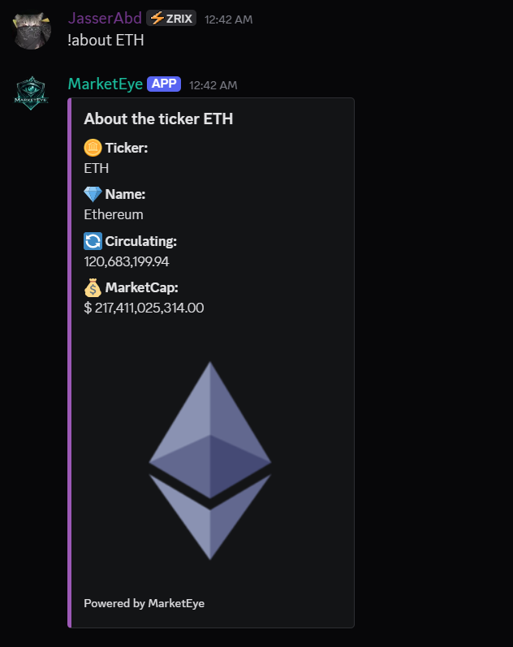
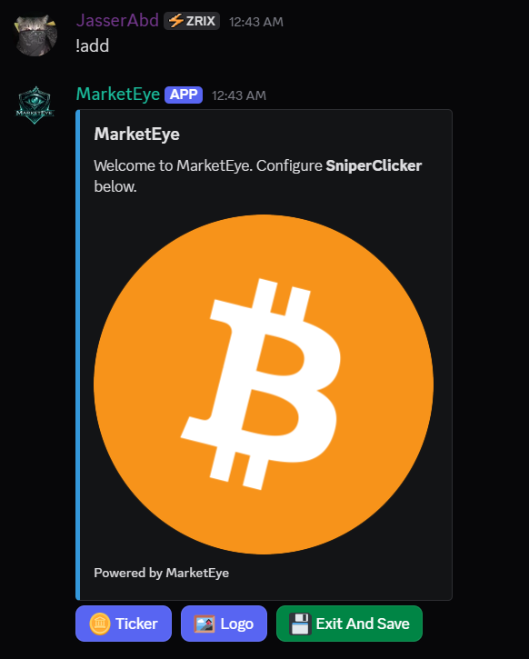

# MarketEye 🐉

A Discord **crypto price bot** that pulls **live data from 100+ exchanges**
(via [CCXT](https://github.com/ccxt/ccxt)) and coin metadata from **CoinGecko**,
and posts rich embeds, candlestick charts, and price alerts.

## Features

| Command | Description |
|---------|-------------|
| `/price [coin]` | Live price, volume, 24h high/low + logo |
| `/chart [candles] [coin] [timeframe]` | Candlestick chart image |
| `/about [coin]` | Name, ticker, circulating supply, market cap |
| `/exchanges` | Paginated list of supported exchanges |
| `/setup` *(or `!add`)* | Button wizard: set the server's default coin & logo |
| `/alert <coin> <above\|below> <price>` | 🔔 **New:** get pinged when a price is hit |
| `/alerts`, `/delalert <id>` | Manage your alerts |
| `/help` | Show all commands |

Every command works as a **slash command** *and* with the classic **`!` prefix**
(`!price`, `!chart 10`, `!about`, `!add`, ...).

---

## Demo

**`!chart` — live candlestick chart (any pair, any timeframe):**



**`!price` — real-time price, volume and 24h high/low:**



**`!alert` — get pinged when a coin crosses your target price:**



**`!about` — coin metadata (name, supply, market cap):**



**`!add` — interactive setup wizard (buttons & modals):**



---

## Setup (Windows)

### 1. Install Python
Install **Python 3.10+** from [python.org](https://www.python.org/downloads/).
During install, tick **"Add Python to PATH"**.

Verify in PowerShell:
```powershell
python --version
```

### 2. Install dependencies
From the project folder:
```powershell
python -m venv .venv
.\.venv\Scripts\Activate.ps1
pip install -r requirements.txt
```
> If `Activate.ps1` is blocked, run once:
> `Set-ExecutionPolicy -Scope CurrentUser RemoteSigned` then try again.

### 3. Create your Discord bot & get the token
1. Go to https://discord.com/developers/applications → **New Application**.
2. Left sidebar → **Bot** → **Reset Token** → **Copy**.
3. On the same **Bot** page, enable **MESSAGE CONTENT INTENT** (required for `!` commands).
4. Left sidebar → **OAuth2 → URL Generator**:
   - Scopes: **bot**, **applications.commands**
   - Bot Permissions: **Send Messages**, **Embed Links**, **Attach Files**, **Read Message History**
   - Copy the generated URL, open it, and invite the bot to your server.

### 4. Add your token
Copy `.env.example` to `.env` and paste your token:
```powershell
Copy-Item .env.example .env
notepad .env
```
Set `DISCORD_TOKEN=your_token_here`. Save and close.

### 5. Run it
```powershell
python bot.py
```
You should see `Logged in as ...` and `Synced N slash commands`.

---

## Usage examples
```
/price BTC
!price ETH
!chart 30 BTC 1h
/about SOL
/alert BTC above 70000
!add            (opens the setup wizard)
```
If you don't pass a coin, the bot uses the server's default coin (set via `/setup`).

---

## Notes & tips
- **Slash commands not showing up?** Global sync can take up to an hour the first
  time. For instant testing, add a guild sync — see the comment in `bot.py`
  (`self.tree.sync()`), or just use the `!` prefix commands meanwhile.
- **Change the default exchange/quote** in `.env` (`DEFAULT_EXCHANGE`, `DEFAULT_QUOTE`).
  Any [CCXT exchange id](https://docs.ccxt.com/#/README?id=exchanges) works
  (`binance`, `kraken`, `kucoin`, `coinbase`, ...).
- **Data storage** is a local SQLite file (`tyr_pricebot.db`) — no database server needed.
- Keep your **`.env` private**. Never commit or share your token.

## Project layout
```
bot.py            Entry point (loads cogs, syncs commands)
config.py         Settings from .env
db.py             SQLite: guild config + alerts
utils.py          Formatting + per-guild defaults
data/prices.py    CCXT tickers/candles + CoinGecko metadata
data/charts.py    Candlestick chart rendering (mplfinance)
cogs/             One file per command group
```
